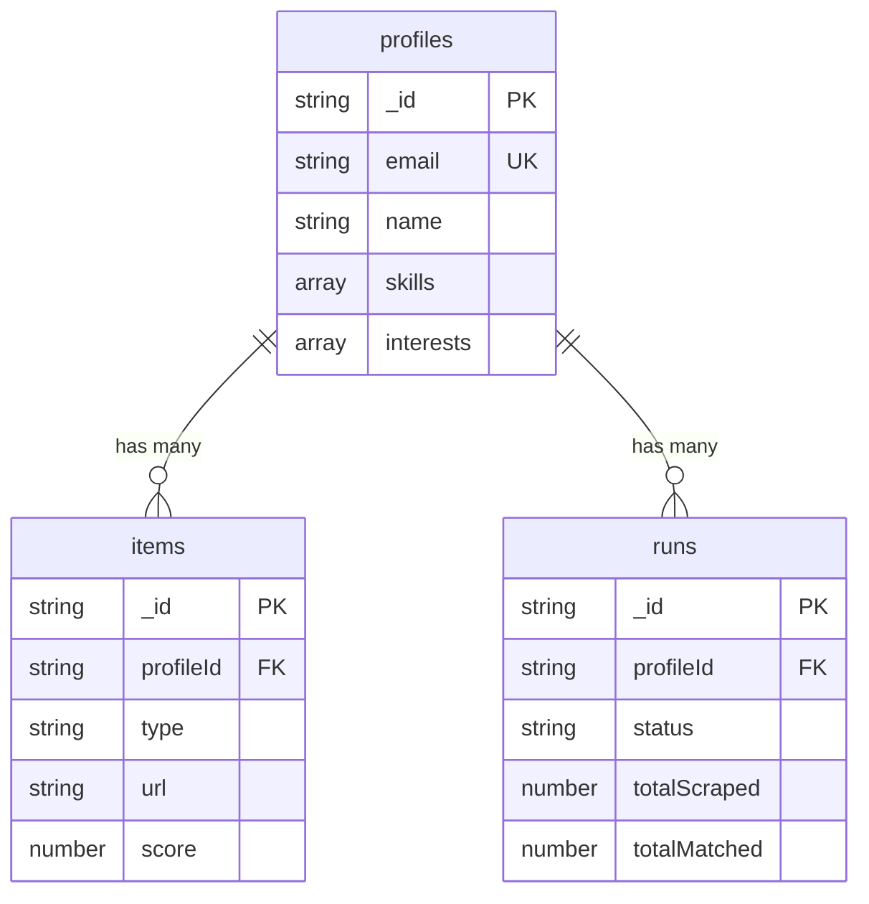

## Overview

Agentic Life Hunter uses [Convex](https://convex.dev) as its real-time database backend. The schema is defined in `convex/schema.ts` and consists of three main tables:

- **profiles** — User profiles with skills, interests, and source preferences
- **items** — Scraped and AI-scored digest items (jobs, deals, research)
- **runs** — Agent execution logs for tracking and debugging

<Note>
All tables use Convex's auto-generated `_id` field (type `Id<"table_name">`) as the primary key.
</Note>

---

## Schema Definition

Here's the complete schema from the codebase:

```typescript convex/schema.ts
import { defineSchema, defineTable } from "convex/server";
import { v } from "convex/values";

export default defineSchema({
  // ─── User Profiles ────────────────────────────────────────────────
  profiles: defineTable({
    name: v.string(),
    email: v.string(),
    skills: v.array(v.string()),
    interests: v.array(v.string()),
    sources: v.array(v.string()),
    scoreThreshold: v.optional(v.number()),
    createdAt: v.number(),
    updatedAt: v.optional(v.number()),
  }).index("by_email", ["email"]),

  // ─── Digest Items ─────────────────────────────────────────────────
  items: defineTable({
    profileId: v.id("profiles"),
    type: v.union(
      v.literal("job"),
      v.literal("deal"),
      v.literal("research")
    ),
    source: v.string(),
    title: v.string(),
    url: v.string(),
    content: v.optional(v.string()),
    aiSummary: v.optional(v.string()),
    score: v.number(),
    createdAt: v.number(),
  })
    .index("by_profile", ["profileId"])
    .index("by_profile_and_url", ["profileId", "url"])
    .index("by_score", ["score"]),

  // ─── Agent Run Logs ───────────────────────────────────────────────
  runs: defineTable({
    profileId: v.id("profiles"),
    status: v.union(
      v.literal("running"),
      v.literal("completed"),
      v.literal("failed")
    ),
    sources: v.array(v.string()),
    totalScraped: v.optional(v.number()),
    totalMatched: v.optional(v.number()),
    error: v.optional(v.string()),
    startedAt: v.number(),
    completedAt: v.optional(v.number()),
  }).index("by_profile", ["profileId"]),
});
```

---

## Tables

### `profiles`

Stores user profile data including skills, interests, and source preferences. The CLI uses email as a unique identifier.

<ResponseField name="name" type="string" required>
  User's display name
</ResponseField>

<ResponseField name="email" type="string" required>
  User's email address (unique, indexed)
</ResponseField>

<ResponseField name="skills" type="string[]" required>
  Array of technical skills (e.g., `["TypeScript", "React", "Machine Learning"]`)
</ResponseField>

<ResponseField name="interests" type="string[]" required>
  Array of interests (e.g., `["AI", "startups", "open source"]`)
</ResponseField>

<ResponseField name="sources" type="string[]" required>
  Enabled scraping sources (e.g., `["Hacker News", "Product Hunt", "Reddit"]`)
</ResponseField>

<ResponseField name="scoreThreshold" type="number" default="40">
  Minimum AI match score (0-100) to include items in the digest
</ResponseField>

<ResponseField name="createdAt" type="number" required>
  Unix timestamp (milliseconds) of profile creation
</ResponseField>

<ResponseField name="updatedAt" type="number">
  Unix timestamp (milliseconds) of last profile update
</ResponseField>

**Indexes:**
- `by_email`: Allows fast lookups by email address (used during profile creation and login)

---

### `items`

Stores scraped and AI-scored digest items. Each item represents a job posting, deal, or research article that matched the user's profile.

<ResponseField name="profileId" type="Id<'profiles'>" required>
  Reference to the owning profile
</ResponseField>

<ResponseField name="type" type="'job' | 'deal' | 'research'" required>
  Item category determined by AI scoring
</ResponseField>

<ResponseField name="source" type="string" required>
  Source name (e.g., `"Hacker News"`, `"Product Hunt"`, `"Reddit r/programming"`)
</ResponseField>

<ResponseField name="title" type="string" required>
  Item title or headline
</ResponseField>

<ResponseField name="url" type="string" required>
  Link to the original item (unique per profile)
</ResponseField>

<ResponseField name="content" type="string">
  Excerpt or description of the item (if available)
</ResponseField>

<ResponseField name="aiSummary" type="string">
  AI-generated one-sentence summary of relevance
</ResponseField>

<ResponseField name="score" type="number" required>
  AI match score (0-100) based on profile skills and interests
</ResponseField>

<ResponseField name="createdAt" type="number" required>
  Unix timestamp (milliseconds) when the item was scraped
</ResponseField>

**Indexes:**
- `by_profile`: Fast queries for all items belonging to a profile
- `by_profile_and_url`: Deduplication — prevents duplicate URLs per profile
- `by_score`: Enables sorting by match score

---

### `runs`

Logs each agent execution for debugging and tracking scraper performance.

<ResponseField name="profileId" type="Id<'profiles'>" required>
  Reference to the profile this run belongs to
</ResponseField>

<ResponseField name="status" type="'running' | 'completed' | 'failed'" required>
  Current execution status
</ResponseField>

<ResponseField name="sources" type="string[]" required>
  List of sources that were scraped in this run
</ResponseField>

<ResponseField name="totalScraped" type="number">
  Total number of items fetched from all sources (before filtering)
</ResponseField>

<ResponseField name="totalMatched" type="number">
  Number of items that passed the score threshold and were saved
</ResponseField>

<ResponseField name="error" type="string">
  Error message if the run failed
</ResponseField>

<ResponseField name="startedAt" type="number" required>
  Unix timestamp (milliseconds) when the run started
</ResponseField>

<ResponseField name="completedAt" type="number">
  Unix timestamp (milliseconds) when the run finished
</ResponseField>

**Indexes:**
- `by_profile`: Query run history for a specific profile

---

## Relationships



- Each **profile** can have many **items** and **runs**
- Items and runs reference their parent profile via `profileId`
- Items are deduplicated by `(profileId, url)` — same URL can appear for different profiles

---

## Common Queries

### Get Profile by Email

```typescript
const profile = await ctx.db
  .query("profiles")
  .withIndex("by_email", (q) => q.eq("email", "user@example.com"))
  .unique();
```

### Get All Items for a Profile (Sorted by Score)

```typescript
const items = await ctx.db
  .query("items")
  .withIndex("by_profile", (q) => q.eq("profileId", profileId))
  .order("desc")
  .take(50);

// Secondary sort by score
items.sort((a, b) => b.score - a.score);
```

### Deduplicate Items (Upsert Pattern)

```typescript
const existing = await ctx.db
  .query("items")
  .withIndex("by_profile_and_url", (q) =>
    q.eq("profileId", profileId).eq("url", itemUrl)
  )
  .unique();

if (existing) {
  // Update if new score is higher
  if (newScore > existing.score) {
    await ctx.db.patch(existing._id, { score: newScore });
  }
} else {
  // Insert new item
  await ctx.db.insert("items", { ... });
}
```

---

## Next Steps

<CardGroup cols={2}>
  <Card title="Custom Agents" icon="robot" href="/advanced/custom-agents">
    Learn how to build your own scraping agents
  </Card>
  <Card title="Troubleshooting" icon="wrench" href="/advanced/troubleshooting">
    Common database connection issues and solutions
  </Card>
</CardGroup>