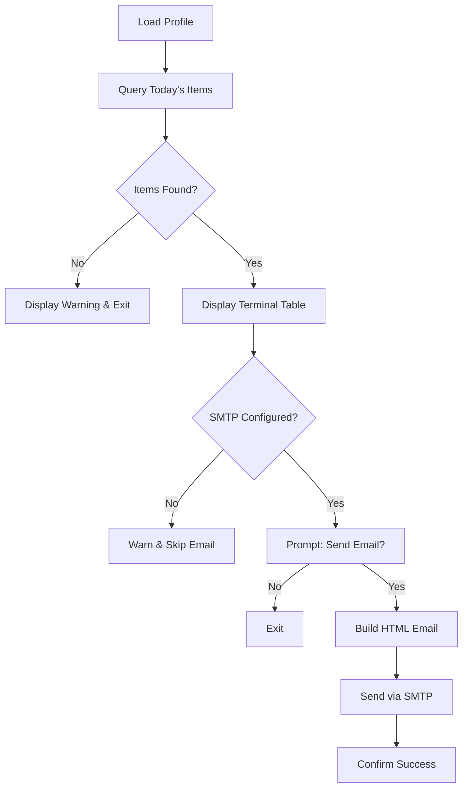

## Overview

The `life-hunter daily` command finds today's matched opportunities and sends them as a beautifully formatted email digest. This allows you to stay updated on new opportunities without manually running hunts or checking the terminal.

## Prerequisites

<Check>
  Before using email digests, ensure you have:
  
  - ✅ Completed [profile setup](/guides/profile-setup)
  - ✅ Configured [SMTP environment variables](/guides/configuration#email-digest-smtp)
  - ✅ Run at least one hunt to populate items
</Check>

## SMTP Configuration

Email digests require SMTP credentials. Add these to your `.env` file:

```bash .env
SMTP_HOST=smtp.gmail.com
SMTP_PORT=587
SMTP_USER=your-email@gmail.com
SMTP_PASS=your-app-password
EMAIL_FROM=Agentic Life Hunter <your-email@gmail.com>
```

See the [Configuration Guide](/guides/configuration#email-digest-smtp) for detailed setup instructions for Gmail, Outlook, and other providers.

## Running the Daily Command

Execute the daily digest:

```bash
life-hunter daily
```

You'll see:

```
  📬 Daily Digest
  ─────────────────────────────────────

ℹ Using profile: Alex Chen (alex@example.com)
⠼ Fetching today's digest...
```

## Workflow Breakdown

The daily command follows this process:



### Stage 1: Profile Selection

Same as the `hunt` command:

- **Single profile:** Auto-selected
- **Multiple profiles:** Interactive prompt

```
? Select a profile:
  ❯ Alex Chen (alex@example.com)
    Alex - Jobs (alex@example.com)
```

### Stage 2: Fetch Today's Items

The command queries Convex for items where:
- `profileId` matches your selected profile
- `scrapedAt` is within the last 24 hours
- `score` is above your profile's threshold

This means **you must run `hunt` first** to have items for the digest.

<Warning>
  If no items are found, you'll see:
  ```
  ⚠ No items found for today.
  ℹ Run life-hunter hunt first to populate the digest.
  ```
  
  The command exits without sending an email.
</Warning>

### Stage 3: Terminal Preview

Before sending email, the digest is displayed in your terminal:

```
ℹ Found 12 items for today's digest

┌─────┬────────────┬────────────────────┬───────────────────────────────┬────────┐
│  #  │    Type    │       Source       │            Title              │ Score  │
├─────┼────────────┼────────────────────┼───────────────────────────────┼────────┤
│  1  │ 💼 job     │ Reddit r/forhire   │ Senior React Dev - Remote     │   92   │
│  2  │ 🔬 research│ Hacker News        │ Show HN: AI Agent Framework   │   88   │
...
```

This lets you review what will be sent.

### Stage 4: SMTP Check

The command checks if SMTP is configured:

```typescript
if (!SMTP_HOST || !SMTP_USER || !SMTP_PASS) {
  console.warn("SMTP not configured — skipping email.");
  return;
}
```

If any SMTP variable is missing, the command warns you and exits gracefully.

### Stage 5: Email Confirmation Prompt

You're asked to confirm before sending:

```
? Send digest email to alex@example.com? (Y/n)
```

- **Enter/Y:** Proceed with sending
- **n:** Cancel and exit

This prevents accidental emails during testing.

### Stage 6: Email Construction & Sending

If confirmed, the CLI:

1. **Builds HTML email** using the digest template
2. **Connects to SMTP server** via Nodemailer
3. **Sends the email** to your profile's email address
4. **Confirms success**

```
⠼ Sending email to alex@example.com...
✔ Email sent to alex@example.com!
```

## Email Template

The digest email is beautifully designed with:

### Header

- Gradient background (indigo → purple → pink)
- Large "🧬 Agentic Life Hunter" title
- Subtitle: "Your daily opportunity digest"

### Body

Personalized greeting:

```html
Hey Alex! 👋 Here are today's 12 matched opportunities:
```

### Results Table

| Type | Title | Score | Source |
|------|-------|-------|--------|
| 💼 job | [Senior React Developer - Remote](#) | **92** | Reddit r/forhire |
| 🔬 research | [Show HN: AI Agent Framework](#) | **88** | Hacker News |
| 🏷️ deal | [TypeScript Toolkit - 50% off](#) | **76** | Product Hunt |

- **Title column:** Clickable links to the actual opportunity
- **Score column:** Bold and prominent
- **Type column:** Emoji + label for quick scanning

### Footer

```
Sent by Life Hunter CLI • 3/14/2026
```

Gray, small text with timestamp.

## Customizing Email Templates

The email HTML is generated in `src/commands/daily.ts` (lines 139-183). To customize:

<Steps>
  <Step title="Locate the template code">
    Open `src/commands/daily.ts` and find the `html` constant around line 159.
  </Step>
  
  <Step title="Modify the HTML">
    Edit the inline styles, colors, or layout:
    
    ```typescript
    // Change gradient colors
    background: linear-gradient(135deg, #your-color-1, #your-color-2);
    
    // Change font
    font-family: 'Your Font', sans-serif;
    
    // Adjust spacing
    padding: 32px; // was 24px
    ```
  </Step>
  
  <Step title="Test your changes">
    Run `npm run build` to recompile, then test with `life-hunter daily`.
  </Step>
</Steps>

<Note>
  Future versions may support external HTML templates or theme files for easier customization without code changes.
</Note>

## Scheduling Daily Digests

To truly automate your digest, schedule both the hunt and email:

### Option 1: Cron Job (Linux/macOS)

<Steps>
  <Step title="Open your crontab">
    ```bash
    crontab -e
    ```
  </Step>
  
  <Step title="Add scheduled commands">
    ```bash
    # Run hunt at 8:00 AM daily
    0 8 * * * cd /path/to/life-hunter && npm start hunt >> /tmp/hunt.log 2>&1
    
    # Send digest at 9:00 AM daily (after hunt completes)
    0 9 * * * cd /path/to/life-hunter && npm start daily -- --auto-send >> /tmp/daily.log 2>&1
    ```
    
    <Warning>
      The `--auto-send` flag doesn't exist yet - you'll need to modify the code to skip the confirmation prompt for automated runs. See customization below.
    </Warning>
  </Step>
  
  <Step title="Save and verify">
    ```bash
    # List your cron jobs
    crontab -l
    ```
  </Step>
</Steps>

### Option 2: GitHub Actions (Cloud Automation)

For serverless automation:

<Steps>
  <Step title="Create workflow file">
    Add `.github/workflows/daily-digest.yml`:
    
    ```yaml
    name: Daily Digest
    
    on:
      schedule:
        - cron: '0 9 * * *' # 9 AM UTC daily
      workflow_dispatch: # Manual trigger
    
    jobs:
      hunt-and-digest:
        runs-on: ubuntu-latest
        steps:
          - uses: actions/checkout@v3
          
          - name: Setup Node.js
            uses: actions/setup-node@v3
            with:
              node-version: '18'
          
          - name: Install dependencies
            run: npm install
          
          - name: Run hunt
            env:
              CONVEX_URL: ${{ secrets.CONVEX_URL }}
              OPENAI_API_KEY: ${{ secrets.OPENAI_API_KEY }}
            run: npm start hunt
          
          - name: Send digest
            env:
              CONVEX_URL: ${{ secrets.CONVEX_URL }}
              SMTP_HOST: ${{ secrets.SMTP_HOST }}
              SMTP_PORT: ${{ secrets.SMTP_PORT }}
              SMTP_USER: ${{ secrets.SMTP_USER }}
              SMTP_PASS: ${{ secrets.SMTP_PASS }}
              EMAIL_FROM: ${{ secrets.EMAIL_FROM }}
            run: npm start daily
    ```
  </Step>
  
  <Step title="Add repository secrets">
    In GitHub repo settings → Secrets and variables → Actions, add:
    - `CONVEX_URL`
    - `OPENAI_API_KEY`
    - `SMTP_HOST`
    - `SMTP_PORT`
    - `SMTP_USER`
    - `SMTP_PASS`
    - `EMAIL_FROM`
  </Step>
  
  <Step title="Enable Actions">
    Commit and push the workflow file. GitHub Actions will run daily at 9 AM UTC.
  </Step>
</Steps>

### Option 3: Convex Cron (Future Feature)

<Note>
  A future update will add Convex-native cron jobs to run hunts and send digests entirely within the Convex backend, eliminating the need for external schedulers.
</Note>

## Auto-Send Mode (Advanced)

For fully automated digests without confirmation prompts, modify `src/commands/daily.ts`:

<Steps>
  <Step title="Add command-line flag support">
    ```typescript
    // At the top of dailyCommand()
    const autoSend = process.argv.includes('--auto-send');
    ```
  </Step>
  
  <Step title="Skip confirmation prompt">
    Replace lines 110-117 with:
    
    ```typescript
    let sendEmail = autoSend;
    
    if (!autoSend) {
      const answer = await inquirer.prompt([...]);
      sendEmail = answer.sendEmail;
    }
    ```
  </Step>
  
  <Step title="Rebuild and test">
    ```bash
    npm run build
    npm start daily -- --auto-send
    ```
  </Step>
</Steps>

Now `life-hunter daily --auto-send` will skip the prompt and send immediately.

## Troubleshooting

<AccordionGroup>
  <Accordion title="No items found for today">
    **Cause:** You haven't run `hunt` recently, or all items were scraped yesterday.
    
    **Solution:**
    ```bash
    # Run a fresh hunt first
    life-hunter hunt
    
    # Then try daily again
    life-hunter daily
    ```
  </Accordion>
  
  <Accordion title="SMTP authentication failed">
    **Cause:** Incorrect SMTP credentials or security settings.
    
    **Solution:**
    - For Gmail: Ensure you're using an **app password**, not your account password
    - Check `SMTP_HOST`, `SMTP_PORT`, `SMTP_USER`, `SMTP_PASS` in `.env`
    - Try port 465 (SSL) if 587 (TLS) fails:
      ```bash
      SMTP_PORT=465
      ```
    - Test with a simple Nodemailer script to isolate the issue
  </Accordion>
  
  <Accordion title="Email sent but not received">
    **Cause:** Email filtered to spam, or incorrect recipient address.
    
    **Solution:**
    - Check your spam/junk folder
    - Verify the email address in your profile matches your inbox
    - Add your `EMAIL_FROM` address to your contacts to whitelist it
    - Check SMTP provider logs (e.g., Gmail "Sent" folder)
  </Accordion>
  
  <Accordion title="Email formatting looks broken">
    **Cause:** Email client doesn't support HTML or inline styles.
    
    **Solution:**
    - Modern email clients (Gmail, Outlook, Apple Mail) should render correctly
    - Avoid using external CSS files - only inline styles work in email
    - Test in multiple clients if customizing the template
  </Accordion>
  
  <Accordion title="Timeout when sending email">
    **Cause:** SMTP server is slow or unreachable.
    
    **Solution:**
    - Check your internet connection
    - Verify SMTP server is operational (check provider status page)
    - Try increasing the timeout in `src/commands/daily.ts`:
      ```typescript
      const transporter = nodemailer.createTransport({
        // ...
        connectionTimeout: 10000, // 10 seconds
      });
      ```
  </Accordion>
</AccordionGroup>

## Email Best Practices

<CardGroup cols={2}>
  <Card title="Consistent timing" icon="clock">
    Send digests at the same time daily (e.g., 9 AM) to build a habit
  </Card>
  
  <Card title="Whitelist sender" icon="shield-check">
    Add your `EMAIL_FROM` to contacts to prevent spam filtering
  </Card>
  
  <Card title="Monitor inbox rules" icon="filter">
    Create a Gmail filter or Outlook rule to label/folder digest emails
  </Card>
  
  <Card title="Adjust threshold" icon="sliders">
    If digests are too long, increase your score threshold to reduce volume
  </Card>
</CardGroup>

## Gmail Filter Example

Auto-label digest emails:

<Steps>
  <Step title="Open Gmail filters">
    Settings → See all settings → Filters and Blocked Addresses → Create a new filter
  </Step>
  
  <Step title="Define filter criteria">
    ```
    From: your-email@gmail.com
    Subject: Life Hunter Digest
    ```
  </Step>
  
  <Step title="Choose action">
    - Apply label: "Life Hunter"
    - Skip inbox (if you want to review in batch)
    - Mark as important
  </Step>
</Steps>

Now all digests automatically go to the "Life Hunter" label.

## Next Steps

<CardGroup cols={2}>
  <Card title="Configuration" icon="gear" href="/guides/configuration">
    Fine-tune your SMTP and API settings
  </Card>
  
  <Card title="CLI Reference" icon="terminal" href="/commands">
    Explore all available commands and options
  </Card>
</CardGroup>
