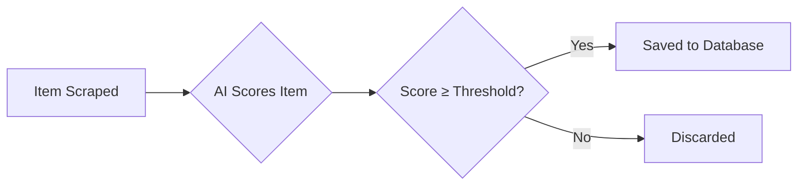

## Overview

Your profile is the heart of Agentic Life Hunter - it tells the AI agents what to look for across the web. The `life-hunter setup` command guides you through an interactive configuration process that captures your skills, interests, preferred sources, and matching sensitivity.

## Running Setup

Start the interactive setup process:

```bash
life-hunter setup
```

You'll be greeted with:

```
  🧬 Profile Setup
  ─────────────────────────────────────────
  Configure your profile so the AI agents know what to hunt for.
```

## Profile Fields Explained

### 1. Your Name

<ParamField path="name" type="string" required>
  Your full name or preferred identifier
</ParamField>

**Prompt:**
```
? Your name:
```

**Purpose:** Used for personalization in email digests and profile identification.

**Example:** `Alex Chen`

**Validation:** Cannot be empty.

---

### 2. Email Address

<ParamField path="email" type="string" required>
  Valid email address for receiving daily digests
</ParamField>

**Prompt:**
```
? Email address:
```

**Purpose:** 
- Identifies your profile
- Receives daily digest emails (if SMTP is configured)
- Shown in profile selection when you have multiple profiles

**Example:** `alex@example.com`

**Validation:** Must be a valid email format (`name@domain.com`)

---

### 3. Your Skills

<ParamField path="skills" type="array" required>
  Comma-separated list of your technical skills and expertise
</ParamField>

**Prompt:**
```
? Your skills (comma-separated):
  (TypeScript, React, Node.js, Python)
```

**Purpose:** AI agents use this to:
- Match job postings requiring these skills
- Find projects and discussions in your technology stack
- Score opportunities based on skill alignment

**Default:** `TypeScript, React, Node.js, Python`

**Best Practices:**

<AccordionGroup>
  <Accordion title="Be specific and consistent">
    Use exact terms that appear in job postings and technical discussions:
    
    ✅ **Good:**
    - `TypeScript` (not `TS` or `Typescript`)
    - `React` (not `ReactJS` or `React.js`)
    - `PostgreSQL` (not `Postgres` or `postgres`)
    
    ❌ **Avoid:**
    - Abbreviations: `JS`, `TS`, `K8s`
    - Overly generic terms: `coding`, `programming`
    - Inconsistent capitalization
  </Accordion>
  
  <Accordion title="Include frameworks and tools">
    Don't just list languages - include frameworks, databases, and tools:
    
    ```
    Python, Django, FastAPI, PostgreSQL, Redis, Docker, AWS
    ```
    
    This captures opportunities requiring your full stack, not just the base language.
  </Accordion>
  
  <Accordion title="Mix seniority levels appropriately">
    Include both fundamental and advanced skills:
    
    - **Junior/Mid:** Focus on core technologies you're comfortable with
    - **Senior:** Add architecture patterns, leadership, specific domains
    
    Example (Senior):
    ```
    TypeScript, React, Next.js, Node.js, GraphQL, Microservices, Team Leadership
    ```
  </Accordion>
  
  <Accordion title="Keep it current">
    Focus on skills you actively use or want to use. Outdated skills may match irrelevant opportunities:
    
    ✅ Include: Technologies you use or are learning
    ❌ Skip: Ancient frameworks you haven't touched in 5 years (unless you want to)
  </Accordion>
</AccordionGroup>

**Example Inputs:**

<CodeGroup>
  ```text Full-Stack Developer
  TypeScript, React, Node.js, PostgreSQL, Docker, AWS, GraphQL
  ```
  
  ```text Data Scientist
  Python, PyTorch, TensorFlow, Pandas, Jupyter, SQL, Machine Learning
  ```
  
  ```text DevOps Engineer
  Kubernetes, Docker, Terraform, AWS, GCP, CI/CD, Prometheus, Grafana
  ```
  
  ```text Mobile Developer
  React Native, Swift, Kotlin, iOS, Android, Firebase, Redux
  ```
</CodeGroup>

---

### 4. Your Interests

<ParamField path="interests" type="array" required>
  Comma-separated list of topics, industries, and themes you care about
</ParamField>

**Prompt:**
```
? Your interests (comma-separated):
  (AI, startups, open source, web3)
```

**Purpose:** AI agents use this to:
- Find discussions and articles about topics you care about
- Match opportunities in industries you're interested in
- Discover side projects and communities aligned with your passions

**Default:** `AI, startups, open source, web3`

**Best Practices:**

<AccordionGroup>
  <Accordion title="Go beyond tech buzzwords">
    Include domains, causes, and specific areas:
    
    ✅ **Good:**
    ```
    climate tech, education, healthcare, remote work, indie hacking
    ```
    
    ❌ **Too generic:**
    ```
    technology, computers, internet
    ```
  </Accordion>
  
  <Accordion title="Mix broad and specific">
    Balance general themes with niche interests:
    
    ```
    AI, machine learning, LLMs, agent frameworks, autonomous systems
    ```
    
    - `AI` catches broad discussions
    - `LLMs` and `agent frameworks` catch specific technical content
    - `autonomous systems` bridges research and application
  </Accordion>
  
  <Accordion title="Include business interests">
    If you're entrepreneurial or business-minded:
    
    ```
    SaaS, B2B, developer tools, productivity, bootstrapping, venture capital
    ```
  </Accordion>
  
  <Accordion title="Add personal passions">
    Don't be afraid to include non-tech interests if you want opportunities there:
    
    ```
    music production, game development, photography, fitness tech
    ```
  </Accordion>
</AccordionGroup>

**Example Inputs:**

<CodeGroup>
  ```text AI/ML Enthusiast
  artificial intelligence, LLMs, agent systems, automation, RAG, vector databases
  ```
  
  ```text Startup Founder
  SaaS, bootstrapping, indie hacking, product management, growth hacking
  ```
  
  ```text Open Source Contributor
  open source, TypeScript, developer tools, CLI tools, compilers
  ```
  
  ```text Sustainability Focus
  climate tech, renewable energy, carbon tracking, environmental data
  ```
</CodeGroup>

---

### 5. Source Selection

<ParamField path="sources" type="array" required>
  Platforms the agents will scrape for opportunities
</ParamField>

**Prompt:**
```
? Select sources to hunt:
  ◉ Hacker News
  ◉ Product Hunt
  ◉ Reddit
  ◉ Craigslist
```

**Purpose:** Control which platforms are searched during hunts.

**All sources are selected by default.** Use space to toggle, enter to confirm.

**Source Breakdown:**

| Source | What It Finds | Refresh Rate | Typical Results |
|--------|--------------|--------------|------------------|
| **Hacker News** | Top stories, "Who is Hiring" threads, tech discussions | Real-time | 15-25 items |
| **Product Hunt** | New product launches, side projects | Daily | 10-15 items |
| **Reddit** | Posts from tech subreddits (programming, webdev, startups, forhire, etc.) | Real-time | 30-60 items |
| **Craigslist** | Software jobs and gigs in SF Bay Area | Daily | 5-15 items |

**When to Disable Sources:**

<AccordionGroup>
  <Accordion title="Too many results">
    If you're getting overwhelmed with matches, disable high-volume sources like Reddit temporarily.
  </Accordion>
  
  <Accordion title="Geographic restrictions">
    Craigslist defaults to SF Bay Area. If you're not interested in that region, disable it (custom regions coming in future updates).
  </Accordion>
  
  <Accordion title="Content preferences">
    - Disable **Product Hunt** if you only want jobs, not products
    - Disable **Hacker News** if you prefer hands-on opportunities over discussions
  </Accordion>
</AccordionGroup>

**Validation:** Must select at least one source.

---

### 6. Score Threshold

<ParamField path="scoreThreshold" type="number" required>
  Minimum AI match score (0-100) required to save an opportunity
</ParamField>

**Prompt:**
```
? Min AI match score (0-100):
  (40)
```

**Purpose:** Filter out low-relevance items. Only opportunities scoring above this threshold are saved.

**Default:** `40`

**How It Works:**



**Choosing Your Threshold:**

<Tabs>
  <Tab title="Exploratory (20-40)">
    **Best for:**
    - First-time setup
    - Discovering new areas
    - Broad interests
    
    **Characteristics:**
    - More results (50-100+ items per hunt)
    - Some false positives
    - Good for learning what's out there
    
    **Example:** You're open to exploring different roles and industries.
  </Tab>
  
  <Tab title="Balanced (40-60)">
    **Best for:** (Default)
    - Most users
    - Daily digests
    - Moderate specificity
    
    **Characteristics:**
    - Manageable results (20-50 items per hunt)
    - Good signal-to-noise ratio
    - Occasional surprises
    
    **Example:** You know generally what you want but are open to adjacent opportunities.
  </Tab>
  
  <Tab title="Focused (60-80)">
    **Best for:**
    - Specific job searches
    - Niche interests
    - Time-constrained users
    
    **Characteristics:**
    - Fewer results (5-20 items per hunt)
    - High relevance
    - May miss edge cases
    
    **Example:** You're only interested in senior React positions at AI startups.
  </Tab>
  
  <Tab title="Highly Selective (80-100)">
    **Best for:**
    - Very specific criteria
    - Passive job seekers
    - Expert-level opportunities only
    
    **Characteristics:**
    - Very few results (0-5 items per hunt)
    - Extremely high relevance
    - May have empty hunts
    
    **Example:** You're only interested in CTO positions at Series B climate tech startups.
  </Tab>
</Tabs>

<Tip>
  **Start at 40 and adjust:** Run your first hunt with the default threshold of 40. If you get too many irrelevant results, increase it to 50-60. If you get too few results, lower it to 30-35.
</Tip>

**Validation:** Must be between 0 and 100.

---

## Example Profile Configurations

Here are complete example profiles for different use cases:

<AccordionGroup>
  <Accordion title="Junior Developer - First Job">
    ```yaml
    Name: Sarah Martinez
    Email: sarah.dev@gmail.com
    Skills: JavaScript, React, HTML, CSS, Git, REST APIs
    Interests: web development, startups, remote work, learning
    Sources: ✓ All (Hacker News, Product Hunt, Reddit, Craigslist)
    Threshold: 30
    ```
    
    **Why this works:**
    - Focuses on fundamental web skills
    - Includes "learning" as an interest to catch tutorials and resources
    - Lower threshold (30) to discover more opportunities
    - All sources enabled for maximum reach
  </Accordion>
  
  <Accordion title="Senior Engineer - Selective">
    ```yaml
    Name: Marcus Johnson
    Email: marcus.johnson@proton.me
    Skills: Rust, Go, Kubernetes, distributed systems, PostgreSQL, gRPC
    Interests: systems programming, infrastructure, performance engineering, open source
    Sources: ✓ Hacker News, ✓ Reddit (disabled Product Hunt, Craigslist)
    Threshold: 65
    ```
    
    **Why this works:**
    - Specialized skills in systems/infrastructure
    - Higher threshold (65) for quality over quantity
    - Disabled product-focused sources
    - Interests align with technical depth
  </Accordion>
  
  <Accordion title="AI Researcher - Niche Focus">
    ```yaml
    Name: Dr. Lisa Wang
    Email: lwang@research.edu
    Skills: Python, PyTorch, Transformers, CUDA, distributed training, research
    Interests: large language models, AI safety, interpretability, agent frameworks
    Sources: ✓ Hacker News, ✓ Reddit (disabled Product Hunt, Craigslist)
    Threshold: 70
    ```
    
    **Why this works:**
    - Very specific AI/ML skills
    - Research-focused interests
    - High threshold for highly relevant content only
    - Academic/technical sources prioritized
  </Accordion>
  
  <Accordion title="Indie Hacker - Side Projects">
    ```yaml
    Name: Alex Thompson
    Email: alex@buildinpublic.xyz
    Skills: TypeScript, Next.js, Tailwind, Supabase, Stripe, Vercel
    Interests: indie hacking, SaaS, bootstrapping, micro-startups, solo founders
    Sources: ✓ Product Hunt, ✓ Hacker News, ✓ Reddit (disabled Craigslist)
    Threshold: 45
    ```
    
    **Why this works:**
    - Modern solo-developer stack
    - Entrepreneurial interests
    - Product Hunt enabled for inspiration
    - Moderate threshold to catch trends and tools
  </Accordion>
  
  <Accordion title="Career Changer - Exploratory">
    ```yaml
    Name: Jordan Lee
    Email: jordan.code@outlook.com
    Skills: Python, SQL, data analysis, Excel, Tableau
    Interests: data science, analytics, career transition, bootcamps, mentorship
    Sources: ✓ All
    Threshold: 25
    ```
    
    **Why this works:**
    - Mix of current and target skills
    - Career-focused interests
    - Very low threshold (25) to explore broadly
    - All sources for maximum exposure
  </Accordion>
</AccordionGroup>

## After Setup

Once you complete the setup, you'll see a confirmation:

```
✔ Profile saved! ID: abc123...
ℹ Skills: TypeScript, React, Node.js
ℹ Interests: AI, startups, open source
ℹ Sources: Hacker News, Product Hunt, Reddit, Craigslist
ℹ Threshold: 40

  Run life-hunter hunt to start finding opportunities!
```

Your profile is now saved to Convex and ready to use!

## Managing Multiple Profiles

You can create multiple profiles for different purposes:

```bash
# Create a job-hunting profile
life-hunter setup
# (Configure with job-focused settings)

# Create a side-project profile
life-hunter setup
# (Configure with product/startup settings)
```

When running `hunt` or `daily` with multiple profiles, you'll be prompted to select which one to use:

```
? Select a profile:
  ❯ Alex Chen (alex@example.com) — TypeScript, React, Node.js
    Alex Chen - Jobs (alex@example.com) — Python, Django, PostgreSQL
```

## Updating Your Profile

Currently, to update a profile, you need to:

1. Run `life-hunter setup` to create a new profile with updated settings
2. Or manually update via Convex dashboard (advanced)

<Note>
  A `life-hunter profile update` command is planned for a future release to make editing easier.
</Note>

## Tips for Optimal Results

<CardGroup cols={2}>
  <Card title="Update seasonally" icon="calendar">
    Revisit your profile every 3-6 months as your skills and interests evolve
  </Card>
  
  <Card title="Start broad, then narrow" icon="filter">
    Begin with a lower threshold, run a few hunts, then increase based on result quality
  </Card>
  
  <Card title="Use specific terminology" icon="magnifying-glass">
    Mirror the language used in job postings and technical communities
  </Card>
  
  <Card title="Test different thresholds" icon="sliders">
    Try 30, 50, and 70 to see how they affect your results
  </Card>
</CardGroup>

## Next Steps

<CardGroup cols={2}>
  <Card title="Running Agents" icon="robot" href="/guides/running-agents">
    Execute your first hunt and understand the results
  </Card>
  
  <Card title="Email Digest" icon="envelope" href="/guides/email-digest">
    Set up daily automated email summaries
  </Card>
</CardGroup>
