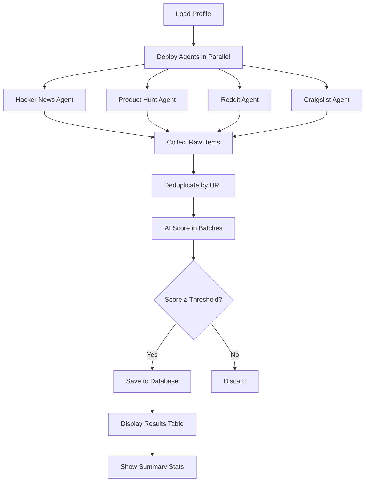

## Overview

The `life-hunter hunt` command is the core of Agentic Life Hunter - it deploys autonomous agents across multiple platforms, scrapes opportunities, scores them against your profile using AI, and presents you with personalized matches.

## Running Your First Hunt

Execute a hunt with:

```bash
life-hunter hunt
```

You'll see the hunting process in action:

```
  🎯 Starting the Hunt
  ─────────────────────────────────────

ℹ Using profile: Alex Chen (alex@example.com)
⠼ Deploying agents... scraping HN, Product Hunt, Reddit, Craigslist
```

## The Hunt Workflow

The hunt command executes a sophisticated multi-stage workflow:



### Stage 1: Profile Loading

<Steps>
  <Step title="Fetch profiles from Convex">
    The CLI queries your Convex database for saved profiles.
  </Step>
  
  <Step title="Profile selection">
    - **Single profile:** Automatically selected and displayed
    - **Multiple profiles:** Interactive prompt to choose which one to use
    
    ```
    ? Select a profile:
      ❯ Alex Chen (alex@example.com) — TypeScript, React, Node.js
        Alex - Jobs (alex@example.com) — Python, Django, PostgreSQL
    ```
  </Step>
  
  <Step title="Load preferences">
    The selected profile's skills, interests, sources, and threshold are loaded.
  </Step>
</Steps>

### Stage 2: Parallel Agent Execution

All enabled agents run **simultaneously** for maximum speed. Here's what each agent does:

<AccordionGroup>
  <Accordion title="Hacker News Agent" icon="y-combinator">
    **Sources:**
    - Top 15 stories from the front page
    - Recent "Who is Hiring" threads via Algolia search
    
    **API Used:** Firebase Realtime Database + HN Algolia
    
    **What it fetches:**
    ```typescript
    {
      title: "Show HN: I built an AI-powered code reviewer",
      url: "https://example.com/ai-reviewer",
      content: "<post text if available>",
      source: "Hacker News"
    }
    ```
    
    **Typical yield:** 15-25 items
    
    **Good for:**
    - Tech discussions and trends
    - "Show HN" project launches
    - Job postings from YC companies
    - Research papers and deep dives
  </Accordion>
  
  <Accordion title="Product Hunt Agent" icon="product-hunt">
    **Sources:**
    - Top 15 products from today's launches
    
    **API Used:** Product Hunt GraphQL API (with HTML fallback)
    
    **What it fetches:**
    ```typescript
    {
      title: "Notion AI — AI-powered productivity assistant",
      url: "https://notion.so",
      content: "AI-powered productivity assistant",
      source: "Product Hunt"
    }
    ```
    
    **Typical yield:** 10-15 items
    
    **Good for:**
    - New SaaS products and tools
    - Side project inspiration
    - Competitor research
    - Developer tool launches
  </Accordion>
  
  <Accordion title="Reddit Agent" icon="reddit">
    **Sources (default):**
    - r/programming (hot, 10 posts)
    - r/webdev (hot, 10 posts)
    - r/MachineLearning (hot, 10 posts)
    - r/startups (hot, 10 posts)
    - r/SideProject (hot, 10 posts)
    - r/forhire (hot, 10 posts)
    
    **API Used:** Reddit JSON API
    
    **What it fetches:**
    ```typescript
    {
      title: "[Hiring] Senior React Developer - Remote - $150k-$180k",
      url: "https://reddit.com/r/forhire/comments/...",
      content: "<first 500 chars of post text>",
      source: "Reddit r/forhire"
    }
    ```
    
    **Typical yield:** 30-60 items
    
    **Good for:**
    - Direct job postings (r/forhire)
    - Technical discussions
    - Side project showcases
    - Industry-specific communities
  </Accordion>
  
  <Accordion title="Craigslist Agent" icon="list">
    **Sources:**
    - SF Bay Area software jobs (sof)
    - SF Bay Area web/info design (web)
    
    **API Used:** RSS feeds (XML parsing)
    
    **What it fetches:**
    ```typescript
    {
      title: "Senior Full Stack Engineer - Early Stage Startup",
      url: "https://sfbay.craigslist.org/sfc/sof/...",
      source: "Craigslist sfbay"
    }
    ```
    
    **Typical yield:** 5-15 items
    
    **Good for:**
    - Local SF Bay Area opportunities
    - Startup jobs
    - Contract/freelance gigs
    - Early-stage companies
    
    <Note>
      Currently hardcoded to `sfbay` region. Custom region support is planned for future releases.
    </Note>
  </Accordion>
</AccordionGroup>

**Parallel Execution Benefits:**
- Total scraping time: ~2-5 seconds (vs. 8-20 seconds sequential)
- Resilient: If one agent fails, others continue
- Logged independently for debugging

### Stage 3: Deduplication

Before AI scoring, items are deduplicated by URL:

```typescript
// Example: Same URL from multiple sources
Hacker News: "Show HN: My new tool" → https://example.com
Product Hunt: "My New Tool - description" → https://example.com
// Result: Only one item kept (first seen)
```

This prevents scoring the same opportunity multiple times.

### Stage 4: AI Scoring

Each unique item is scored against your profile. This is the most compute-intensive stage.

<Tabs>
  <Tab title="With OpenAI (Recommended)">
    **Model:** `gpt-4o-mini`
    
    **Process:**
    1. Build a scoring prompt with item details + your profile
    2. Send to OpenAI with JSON response format
    3. Parse the response for score, type, and summary
    
    **Prompt Structure:**
    ```
    You are an AI career/opportunity matcher. Score this item's relevance.
    
    ITEM:
      Title: Senior React Engineer @ AI Startup
      Source: Hacker News
      Content: We're building the future of AI agents...
    
    USER PROFILE:
      Skills: TypeScript, React, Node.js
      Interests: AI, startups, open source
    
    Respond ONLY with valid JSON:
    {"score": 85, "type": "job", "summary": "React role at AI startup"}
    ```
    
    **AI Response Example:**
    ```json
    {
      "score": 85,
      "type": "job",
      "summary": "Senior React position at AI startup, strong alignment with skills and interests"
    }
    ```
    
    **Batch Processing:** Items are scored in batches of 20 to optimize API usage.
    
    **Cost:** ~$0.0001 per item (~$0.01 for 100 items)
  </Tab>
  
  <Tab title="Without OpenAI (Fallback)">
    **Method:** Simple keyword matching
    
    **Process:**
    1. Concatenate item title + content
    2. Check for each skill and interest (case-insensitive)
    3. Calculate percentage: `(matches / total terms) * 100`
    
    **Type Detection Rules:**
    - Contains "hire" or "job" → `job`
    - Contains "deal" or "sale" → `deal`
    - Otherwise → `research`
    
    **Example:**
    ```typescript
    Profile: ["TypeScript", "React", "AI"]
    Item: "Building a TypeScript AI agent with React"
    // Matches: TypeScript, React, AI = 3/3 = 100% score
    
    Profile: ["Python", "Django", "PostgreSQL"]
    Item: "Building a TypeScript AI agent with React"
    // Matches: 0/3 = 0% score
    ```
    
    **Limitations:**
    - No semantic understanding ("React" won't match "React Native")
    - Can't detect context ("avoid Python" would still match "Python")
    - Binary matching (no partial credit for related terms)
  </Tab>
</Tabs>

### Stage 5: Filtering & Storage

Items scoring **above your threshold** are saved to Convex:

```typescript
// Item with score 85, threshold 40 → Saved ✓
// Item with score 35, threshold 40 → Discarded ✗
```

Saved fields:
- `profileId` - Links to your profile
- `type` - job | deal | research
- `source` - Platform it came from
- `title` - Original title
- `url` - Link to opportunity
- `content` - Full text if available
- `aiSummary` - AI-generated summary
- `score` - Relevance score (0-100)
- `scrapedAt` - Timestamp

## Understanding the Results Table

After scraping and scoring, you'll see:

```
ℹ Scraped 127 items → 23 matched your profile
⠼ Fetching matched items...
```

Then the results table appears:

```
┌─────┬────────────┬────────────────────┬───────────────────────────────────────────────┬────────┐
│  #  │    Type    │       Source       │                    Title                      │ Score  │
├─────┼────────────┼────────────────────┼───────────────────────────────────────────────┼────────┤
│  1  │ 💼 job     │ Reddit r/forhire   │ [Hiring] Senior React Developer - Remote      │   92   │
│  2  │ 🔬 research│ Hacker News        │ Show HN: I built an AI agent framework        │   88   │
│  3  │ 🏷️  deal    │ Product Hunt       │ TypeScript Toolkit — 50% off for developers   │   76   │
```

### Table Columns Explained

<ParamField path="#" type="number">
  Row number for easy reference
</ParamField>

<ParamField path="Type" type="string">
  AI-detected category with emoji:
  - 💼 **job** - Employment opportunities, hiring posts, job boards
  - 🏷️ **deal** - Product launches, discounts, special offers  
  - 🔬 **research** - Technical discussions, papers, Show HN projects
</ParamField>

<ParamField path="Source" type="string">
  Platform where the item was found:
  - `Hacker News` or `HN Who's Hiring`
  - `Product Hunt`
  - `Reddit r/subreddit` (specific subreddit shown)
  - `Craigslist sfbay`
</ParamField>

<ParamField path="Title" type="string">
  Item title, truncated to 52 characters if needed (shows "..." if truncated)
</ParamField>

<ParamField path="Score" type="number">
  AI relevance score (0-100), color-coded:
  - **Green (80-100):** Highly relevant, strong match
  - **Yellow (60-79):** Good match, worth checking out  
  - **Gray (0-59):** Lower relevance, but above your threshold
</ParamField>

### Score Interpretation Guide

<AccordionGroup>
  <Accordion title="90-100: Perfect Match">
    **What it means:**
    - Aligns with multiple skills AND interests
    - Exact terminology match
    - High-quality opportunity
    
    **Action:** Prioritize these - apply immediately or engage deeply
    
    **Example:**
    ```
    Your profile: TypeScript, React, AI, startups
    Item: "Senior React/TS Engineer @ AI Startup (YC W24)"
    Score: 95
    ```
  </Accordion>
  
  <Accordion title="75-89: Strong Match">
    **What it means:**
    - Matches several key skills or interests
    - Relevant but may have some misalignment
    - Worth serious consideration
    
    **Action:** Review these soon, good candidates
    
    **Example:**
    ```
    Your profile: Python, Django, PostgreSQL
    Item: "Django Developer - Growing SaaS Company"
    Score: 82
    ```
  </Accordion>
  
  <Accordion title="60-74: Good Match">
    **What it means:**
    - Partial skill/interest alignment
    - May require learning or stretch
    - Adjacent to your core focus
    
    **Action:** Skim these, pursue if time allows
    
    **Example:**
    ```
    Your profile: React, TypeScript, Node.js
    Item: "Frontend Engineer - Vue.js & TypeScript"
    Score: 68 (Vue instead of React, but TS matches)
    ```
  </Accordion>
  
  <Accordion title="40-59: Threshold Match">
    **What it means:**
    - Meets minimum relevance
    - Tangential to your interests
    - May be worth exploring if curious
    
    **Action:** Low priority, check if the title catches your eye
    
    **Example:**
    ```
    Your profile: Python, machine learning, AI
    Item: "Data Analyst - Python & SQL"
    Score: 45 (Python matches, but not ML/AI focus)
    ```
  </Accordion>
</AccordionGroup>

<Tip>
  **Pro tip:** If most of your results are in the 40-60 range, consider raising your threshold to 50-60 for higher quality matches.
</Tip>

## Summary Statistics

After the table, you'll see a detailed summary:

```
━━━ Hunt Summary ━━━

  Total items:  23
  Avg score:    72
  Top score:    95
  Time:         4.2s

  By Source:
    Reddit r/forhire: 8
    Hacker News: 7
    Product Hunt: 5
    Craigslist sfbay: 3

  By Type:
    💼 job: 12
    🔬 research: 8
    🏷️  deal: 3
```

### Stats Breakdown

<ResponseField name="Total items" type="number">
  Number of items that scored above your threshold and were saved
</ResponseField>

<ResponseField name="Avg score" type="number">
  Mean score across all matched items - useful for gauging overall relevance
</ResponseField>

<ResponseField name="Top score" type="number">
  Highest score achieved - indicates your best match
</ResponseField>

<ResponseField name="Time" type="string">
  Total execution time from agent deployment to result display
</ResponseField>

<ResponseField name="By Source" type="object">
  Breakdown showing which platforms yielded the most matches - helps you understand where your best opportunities come from
</ResponseField>

<ResponseField name="By Type" type="object">
  Distribution of job/deal/research - shows what kind of content is matching your profile
</ResponseField>

## Performance & Optimization

### Typical Execution Times

<Tabs>
  <Tab title="With OpenAI">
    - **Scraping (parallel):** 2-5 seconds
    - **Deduplication:** &lt;1 second
    - **AI Scoring (100 items):** 10-15 seconds
    - **Storage:** 1-2 seconds
    
    **Total:** 15-25 seconds for ~100 items
  </Tab>
  
  <Tab title="Without OpenAI">
    - **Scraping (parallel):** 2-5 seconds
    - **Deduplication:** &lt;1 second
    - **Keyword Scoring (100 items):** 1-2 seconds
    - **Storage:** 1-2 seconds
    
    **Total:** 5-10 seconds for ~100 items
  </Tab>
</Tabs>

### Tips for Faster Hunts

<CardGroup cols={2}>
  <Card title="Disable unused sources" icon="toggle-off">
    If you don't need Craigslist or Product Hunt, disable them in your profile to reduce scraping time
  </Card>
  
  <Card title="Increase threshold" icon="arrow-up">
    Higher thresholds mean fewer items to score and store, speeding up the process
  </Card>
  
  <Card title="Use keyword scoring for speed" icon="bolt">
    If AI accuracy isn't critical, omit `OPENAI_API_KEY` for 3x faster hunts
  </Card>
  
  <Card title="Run during off-peak hours" icon="clock">
    OpenAI API is sometimes faster late at night (UTC)
  </Card>
</CardGroup>

### Handling Errors

<AccordionGroup>
  <Accordion title="Agent fails gracefully">
    If one agent encounters an error (API down, rate limit, etc.), the others continue:
    
    ```
    [PH Agent] GraphQL failed, trying HTML fallback...
    [Reddit Agent] r/programming returned 429 (rate limited)
    ```
    
    You'll still get results from successful agents.
  </Accordion>
  
  <Accordion title="OpenAI rate limits">
    If you hit OpenAI rate limits:
    
    ```
    [AI Scorer] Error scoring "...": Rate limit exceeded
    ```
    
    **Solutions:**
    - Wait 60 seconds and re-run
    - Upgrade your OpenAI tier for higher limits
    - Temporarily remove `OPENAI_API_KEY` to use keyword fallback
  </Accordion>
  
  <Accordion title="Convex connection issues">
    ```
    Error: Could not connect to Convex
    ```
    
    **Solutions:**
    - Check your internet connection
    - Verify `CONVEX_URL` in `.env`
    - Confirm your Convex deployment is active (check dashboard)
  </Accordion>
</AccordionGroup>

## What to Do With Results

After a successful hunt:

<Steps>
  <Step title="Review high-scoring items first">
    Start with scores 80+ - these are your best matches
  </Step>
  
  <Step title="Click through to URLs">
    The terminal table shows titles, but visit the URLs for full details
  </Step>
  
  <Step title="Act quickly on time-sensitive items">
    Job postings and "Who is Hiring" threads can fill up fast
  </Step>
  
  <Step title="Set up email digest for automation">
    Instead of running manually, get results emailed daily
  </Step>
</Steps>

## Running Hunts Regularly

### Manual Scheduling

Run hunts at consistent times:

```bash
# Morning routine
9am: life-hunter hunt

# Evening review
6pm: life-hunter hunt
```

### Automated Scheduling (Advanced)

Use cron to run automated hunts:

```bash
# Edit crontab
crontab -e

# Add: Run hunt daily at 9am
0 9 * * * cd /path/to/life-hunter && npm start hunt >> hunt.log 2>&1
```

<Note>
  For automated **email delivery** of results, use `life-hunter daily` instead - see the [Email Digest guide](/guides/email-digest).
</Note>

## Next Steps

<CardGroup cols={2}>
  <Card title="Email Digest" icon="envelope" href="/guides/email-digest">
    Automate daily hunts with email summaries
  </Card>
  
  <Card title="Architecture Deep Dive" icon="diagram-project" href="/architecture">
    Understand the technical implementation
  </Card>
</CardGroup>
