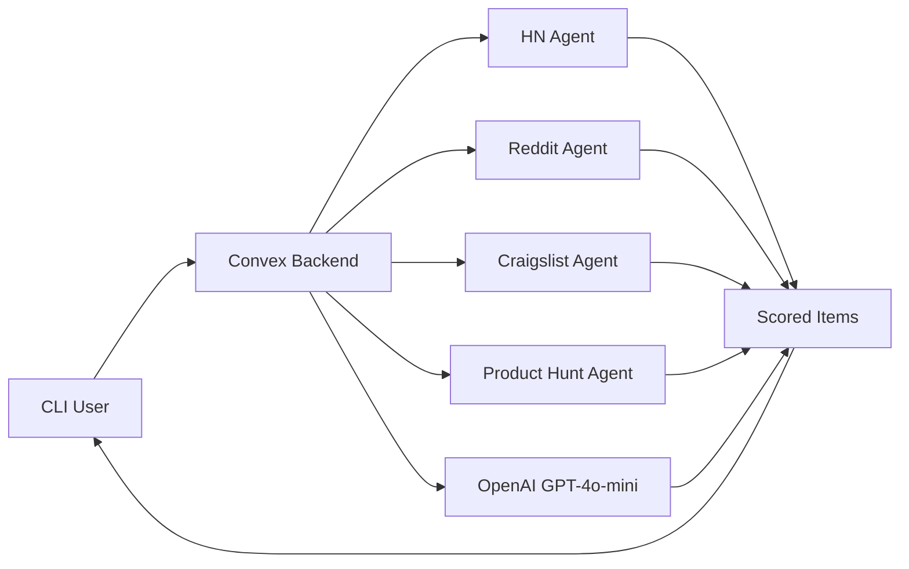

## What is Life Hunter?

Agentic Life Hunter CLI is an **AI-powered command-line tool** that helps you discover opportunities tailored to your unique skills and interests. Instead of manually browsing multiple websites daily, Life Hunter deploys intelligent agents that scrape the web in parallel and use AI to match content to your profile.

Think of it as your personal opportunity scout — working 24/7 to find jobs, deals, trending products, and research that actually matter to you.

<Note>
  Life Hunter uses **OpenAI GPT-4o-mini** for intelligent matching and **Convex** for real-time data storage and orchestration.
</Note>

## Key Features

<CardGroup cols={2}>
  <Card title="AI-Powered Matching" icon="brain">
    Uses OpenAI GPT-4o-mini to score each item (0-100) based on your skills and interests. Falls back to keyword matching when API key is not configured.
  </Card>
  
  <Card title="Parallel Agent Execution" icon="arrows-split-up-and-left">
    Deploys multiple scraping agents simultaneously to gather data from Hacker News, Product Hunt, Reddit, and Craigslist.
  </Card>
  
  <Card title="Smart Deduplication" icon="filter">
    Automatically removes duplicate items by URL across different sources and runs.
  </Card>
  
  <Card title="Beautiful Terminal UI" icon="terminal">
    Gradient banners, spinners, and formatted tables make the CLI experience delightful.
  </Card>
  
  <Card title="Email Digests" icon="envelope">
    Get your daily matched opportunities delivered to your inbox with styled HTML emails.
  </Card>
  
  <Card title="Customizable Profiles" icon="user-gear">
    Configure your skills, interests, preferred sources, and minimum match score threshold.
  </Card>
</CardGroup>

## How It Works



### The Hunt Flow

1. **Profile Setup** — You configure your skills (TypeScript, React, Python), interests (AI, startups, web3), and preferred sources.
2. **Agent Deployment** — When you run `life-hunter hunt`, all enabled agents scrape their sources in parallel via Convex actions.
3. **AI Scoring** — Each scraped item is sent to OpenAI with your profile context to generate a relevance score (0-100) and categorization (job/deal/research).
4. **Deduplication** — Items are deduplicated by URL to avoid showing the same opportunity multiple times.
5. **Display** — Matched items above your score threshold are displayed in a beautiful terminal table.
6. **Email Digest** — Optionally, send today's matches to your email with a styled HTML template.

<Warning>
  Without an OpenAI API key, Life Hunter falls back to simple keyword matching. While functional, AI scoring provides significantly better results.
</Warning>

## Data Sources

Life Hunter currently supports four major sources:

| Source | What It Scrapes | Use Cases |
|:-------|:----------------|:----------|
| **Hacker News** | Top stories + "Who's Hiring" threads | Tech jobs, trending discussions, open source projects |
| **Product Hunt** | Today's trending products | New tools, SaaS deals, innovative startups |
| **Reddit** | r/programming, r/webdev, r/MachineLearning, r/forhire, r/startups, r/SideProject | Jobs, freelance gigs, side project ideas, discussions |
| **Craigslist** | Software & web jobs (SF Bay Area default) | Local jobs, contract work, gigs |

## Who Should Use Life Hunter?

<AccordionGroup>
  <Accordion title="Job Seekers">
    Developers, designers, and tech professionals looking for their next opportunity without spending hours on job boards.
  </Accordion>
  
  <Accordion title="Freelancers & Contractors">
    Find contract work, gigs, and project opportunities from Reddit and Craigslist automatically.
  </Accordion>
  
  <Accordion title="Product Enthusiasts">
    Stay on top of trending products and tools from Product Hunt that match your interests.
  </Accordion>
  
  <Accordion title="Researchers & Learners">
    Discover discussions, papers, and projects related to your technical interests from Hacker News and Reddit.
  </Accordion>
  
  <Accordion title="Startup Founders">
    Monitor competitor launches, market trends, and hiring patterns in your space.
  </Accordion>
</AccordionGroup>

## Architecture Overview

Life Hunter is built with a modern, serverless architecture:

```
life-hunter-cli/
├── bin/
│   └── life-hunter.ts        # CLI entry point (Commander.js)
├── src/
│   ├── commands/
│   │   ├── setup.ts          # Interactive profile setup (Inquirer)
│   │   ├── hunt.ts           # Agent orchestration + display
│   │   └── daily.ts          # Email digest generation (Nodemailer)
│   └── lib/
│       ├── convex-client.ts  # ConvexHttpClient singleton
│       └── ui.ts             # Banner, spinners, tables, colors
├── convex/
│   ├── schema.ts             # Database schema (profiles, items, runs)
│   ├── profiles.ts           # Profile CRUD operations
│   ├── items.ts              # Item management + deduplication + stats
│   └── agents.ts             # Scraping agents + AI scorer + orchestrator
```

### Technology Stack

- **CLI Framework**: [Commander.js](https://github.com/tj/commander.js) for command parsing
- **Backend**: [Convex](https://convex.dev) for real-time database and serverless functions
- **AI**: [OpenAI GPT-4o-mini](https://platform.openai.com/docs/models/gpt-4o-mini) for intelligent matching
- **UI Libraries**: [chalk](https://github.com/chalk/chalk), [boxen](https://github.com/sindresorhus/boxen), [ora](https://github.com/sindresorhus/ora), [cli-table3](https://github.com/cli-table/cli-table3)
- **Scraping**: Native fetch API + [cheerio](https://cheerio.js.org/) for HTML parsing

## Next Steps

<CardGroup cols={2}>
  <Card title="Installation" icon="download" href="/installation">
    Get Life Hunter installed and configured on your system
  </Card>
  
  <Card title="Quick Start" icon="rocket" href="/quickstart">
    Complete end-to-end tutorial from setup to your first hunt
  </Card>
</CardGroup>